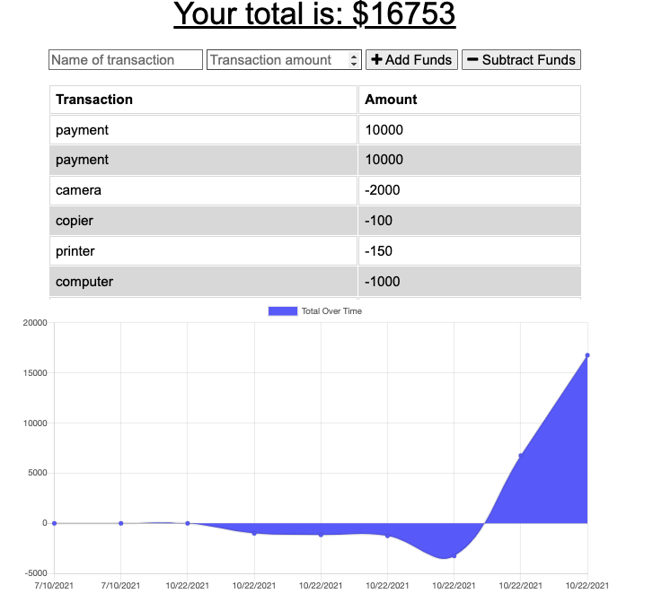

# budget-tracker-pwa

Providing offline accessibility to a budget app and turning it into a PWA.



|                                         |                                         |                                                   |
| :-------------------------------------: | :-------------------------------------: | :-----------------------------------------------: |
|   [Introduction](#budget-tracker-pwa)   | [Table of Contents](#table-of-contents) | [Development Highlights](#development-highlights) |
|      [Installation](#installation)      |    [Page Directory](#page-directory)    |       [Code Hightlights](#code-highlights)        |
| [Technologies Used](#Technologies-Used) |           [Credits](#Credits)           |                [License](#License)                |

## Development Highlights

- Provide offline access to budget tracking using indexDB.
- Create downloadable PWA through creating a manifest.json

## Installation

- Download dependencies

```
npm i
```

- Start app

```
npm start
```

## Page Directory

A idb.js file was created to hold the code for the indexdb.

A manifest.json is created at the public folder to connect to the index.html

## Code Highlights

Posting to the transaction API endpoint to send the saved transactions that failed to post through losing connection.

```JavaScript
    getAll.onsuccess = function () {
        // if there was data in indexedDb's store, let's send it to the api server

        if (getAll.result.length > 0) {

            fetch('/api/transaction/bulk', {
                method: 'POST',
                body: JSON.stringify(getAll.result),
                headers: {
                    Accept: 'application/json, text/plain, */*',
                    'Content-Type': 'application/json'
                }
            })
                .then(response => response.json())
                .then(serverResponse => {
                    if (serverResponse.message) {
                        throw new Error(serverResponse);
                    }

                    const transaction = db.transaction(['new_budget'], 'readwrite');
                    const budgetObjectStore = transaction.objectStore('new_budget');
                    // clear all items in your store
                    budgetObjectStore.clear();
                })
                .catch(err => {
                    // set reference to redirect back here
                    console.log(err);
                });
        }
    };
```

## Technologies

- [indexdb](https://developer.mozilla.org/en-US/docs/Web/API/IndexedDB_API)
- [pwa](https://web.dev/progressive-web-apps/)

## Credits

The starter code was provided by 2U bootcamp.

|                           |                                                                                                                                                                                                       |
| ------------------------- | ----------------------------------------------------------------------------------------------------------------------------------------------------------------------------------------------------- |
| **David Anusontarangkul** | [ LinkedIn](https://www.linkedin.com/in/anusontarangkul/) [ GitHub](https://github.com/anusontarangkul) |

## License

[](https://opensource.org/licenses/
